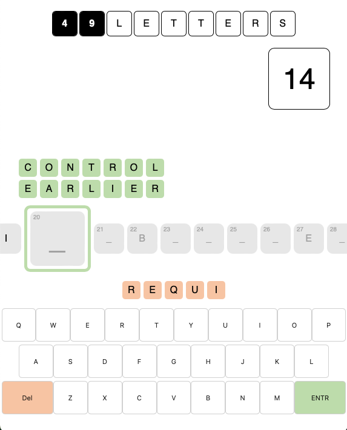

# 49-LETTERS

---

## About this project

A word game designed from scratch with endless possibilities to complete, allowing high scores to 1-up one another.

I designed the concept for this game in my head and thought it would be a challenging project to complete from a logic perspective.

Despite not being much to look at and proving my currently weak UI skills, it does showcase an impressive display of logic, allowing a nearly infinite number of paths to complete.

Users have to fill out a string of 49 letters comprising real words, while navigating around some pre-filled letters to build the longest words and get the most points.

---

## Technologies

JS

CSS

React

NodeJS

Express

MongoDB

---
## Live Link

TBD

---

## Screenshots

### Picture 1

### Picture 2

### Picture 3

